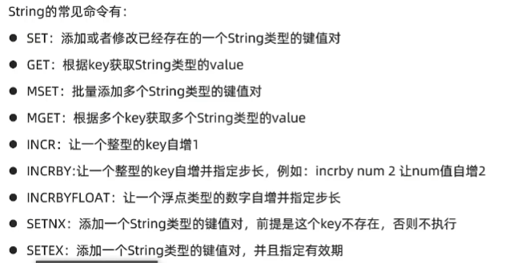
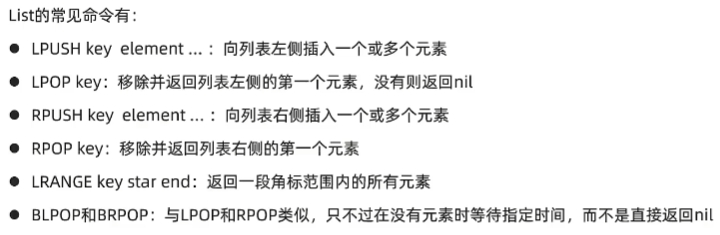
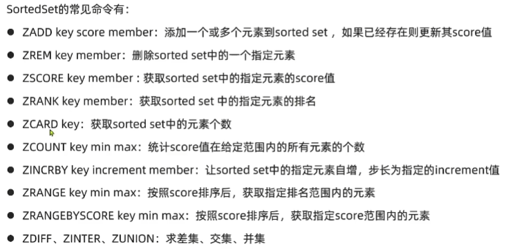
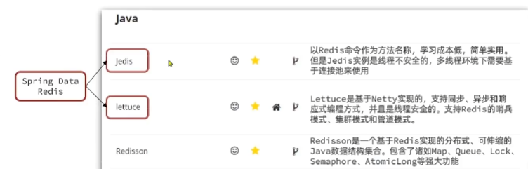

# Redis 学习笔记
## 1、Redis 快速入门
    键值数据库、NoSql
### 1.1 初识 Redis
> * 认识 NoSQL
```text
SQL：关系型数据库  结构化（Structured） 关联的（Relational） SQL查询   ACID
    存储方式：磁盘     扩展性：垂直
NoSQL：非关系数据库（key-value || Document || Graph || 列类型）    非结构化    无关联的    非SQL    BASE
    存储方式：内存     扩展性：水平
```

> * 认识 Redis
```text
基于内存的键值型NoSQL数据库
特征：
    1、键值（key-value）型，value支持多种不同数据结构、
    2、单线程，每个命令具备原子性（网络请求支持多线程）
    3、低延迟，速度快（基于内存、IO多路复用、良好的编码）
    4、支持数据持久化
    5、支持主从集群、分片集群
    6、支持多语言客户端
```
> * 安装 Redis
```text
https://github.com/lework/RedisDesktopManager-Windows/releases
免费版的 Redis 图形化管理工具 
```

### 1.2 Redis 常见命令
#### Redis 数据结构介绍
* 通用命令（常用）：
```text
* keys：查看符合模板的所有key，不建议在生产环境设备上使用
* del：删除一个或多个指定的key
* exists：判断key是否存在
* expire：给一个key设置有效期，有效期到时该key会被自动删除
* ttl：查看一个key的有效期（-1表示永久有效，-2表示过期）
```
> * 5 种常见数据结构
```text
String 类型：字符串类型
    value是字符串，分为3类
        * String：普通字符串
        * int：整数类型，可以做自增、自减操作
        * float：浮点类型，可以做自增、自减操作
```



```text
Hash类型
```


```text
List类型：类似于Java中的LinkedList
```



```text
Set类型：类似于Java中的HashSet
```


```text
SortedSet类型：可排序集合
    默认：升序排名，添加rev可降序
```


### 1.3 Redis 的 Java 客户端



> * Jedis 客户端
>
>   Jedis实例是线程不安全的，多线程环境下需要基于连接池来使用


> * SpringDataRedis 客户端


